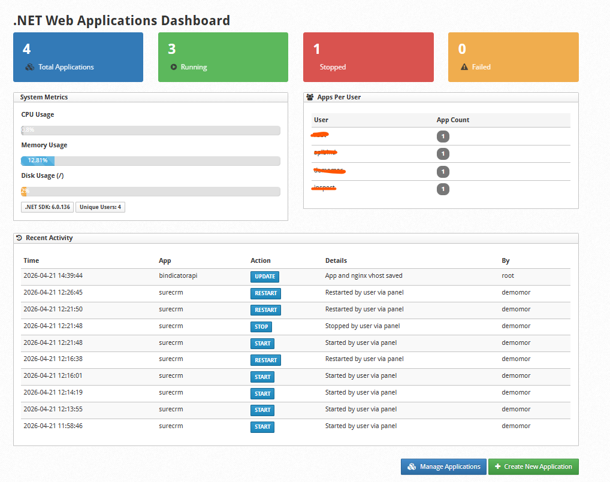
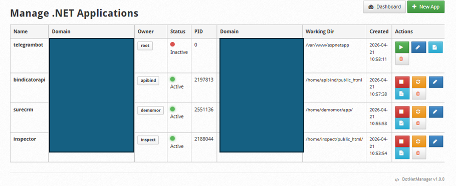
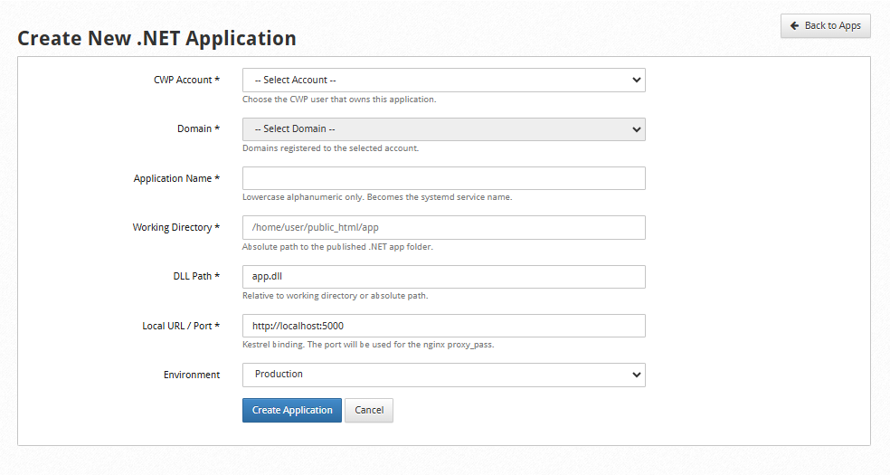
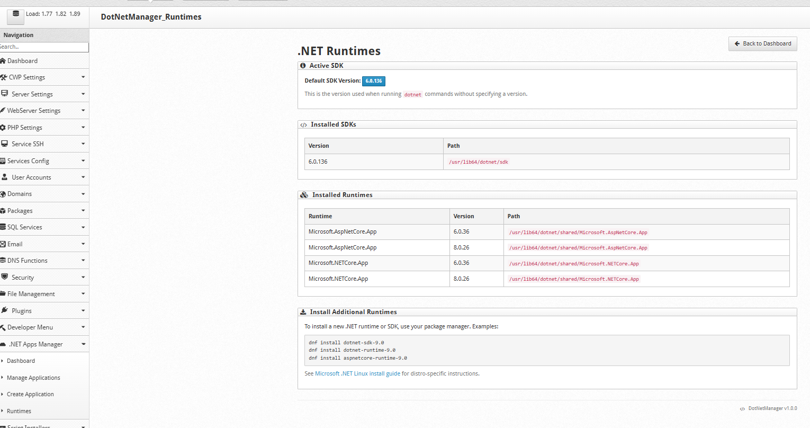
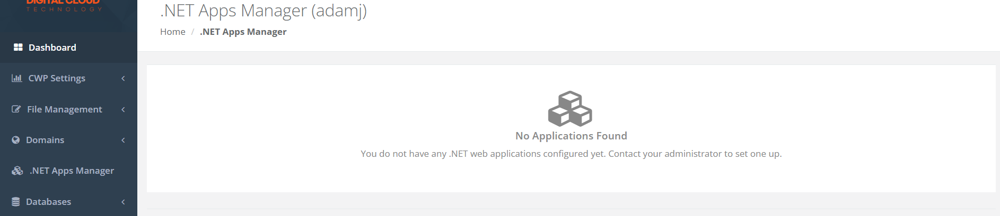
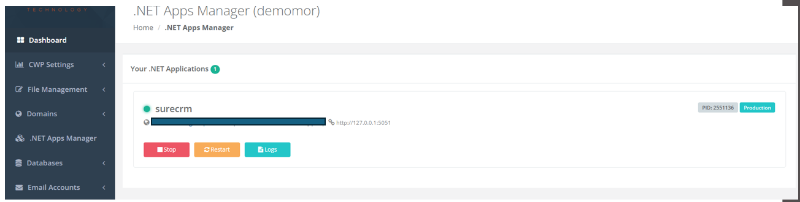

# DotNetManager for CWP

> A multi-role control panel plugin for [Control Web Panel (CWP)](https://control-webpanel.com) that lets administrators and customers manage .NET (ASP.NET Core) web applications directly from the panel.

[](https://opensource.org/licenses/MIT)
[](https://control-webpanel.com)
[](https://dotnet.microsoft.com)

---

## Table of Contents

- [Features](#features)
- [Architecture](#architecture)
- [Prerequisites](#prerequisites)
- [Installation](#installation)
- [File Structure](#file-structure)
- [Usage](#usage)
- [Troubleshooting](#troubleshooting)
- [Uninstallation](#uninstallation)
- [License](#license)

---

## Features

### Admin Panel (Port 2030)

| Module | Description |
|--------|-------------|
| **Dashboard** | Live metrics — total apps, running/stopped/failed counts, CPU/memory/disk usage, apps-per-user breakdown, and recent activity log |
| **Manage Applications** | Full app list with live systemd status, start/stop/restart/delete actions, clickable domain links |
| **Create / Edit Application** | Select a CWP account → select a domain → auto-fill working directory. Generates nginx vhost + systemd service in one click |
| **Logs Viewer** | Journalctl logs, service status output, and action history per application |
| **Runtimes** | View installed .NET runtimes and SDKs |

### Customer Panel (Port 2031)

- **My Applications** — customers see only their own apps
- **Start / Stop / Restart** — one-click controls with AJAX feedback
- **Live Logs** — view journal logs directly without admin access
- **Clickable Domains** — each app shows its public domain as a link to open the site

---

## Architecture

```
┌─────────────────┐     ┌─────────────────┐     ┌─────────────────┐
│   Admin Panel   │     │   Socket Daemon │     │   systemd       │
│   (port 2030)   │────▶│   (socketd.py)  │────▶│   services      │
│   runs as root  │     │   runs as root  │     │                 │
└─────────────────┘     └─────────────────┘     └─────────────────┘
                               ▲
┌─────────────────┐            │
│  Customer Panel │────────────┘
│  (port 2031)    │     SO_PEERCRED identity verification
│  runs as user   │     
└─────────────────┘
```

### How It Works

1. **Account & Domain Selection** — When creating an app, the admin selects a CWP account first. The domain dropdown populates from CWP's `user` and `domains` tables. Selecting a domain auto-fills the working directory from CWP's stored domain path.

2. **Nginx Vhost Generation** — On every create/update, the plugin renders nginx configs from template files (`nginx_http.template` / `nginx_ssl.template`) following pattern:
   - HTTP server forces HTTPS redirect (`return 301 https://...`)
   - HTTPS server enables `ssl http2`, HSTS, and security headers
   - `proxy_pass` routes traffic to the local Kestrel port
   - Static files served directly by nginx with long expiry

3. **Privilege Escalation** — CWP runs user-panel PHP-FPM pools as the actual Unix account user. The **Socket Daemon** (`socketd.py`) runs as root and uses `SO_PEERCRED` to verify the caller's Unix identity. It queries the SQLite DB to confirm app ownership before executing `systemctl` or `journalctl`.

4. **Fallback** — If the socket daemon is unavailable, the user panel falls back to `sudo control.sh`, which performs the same validation.

---

## Prerequisites

- [CentOS Web Panel (CWP)](https://control-webpanel.com) installed
- **nginx** (mandatory — the plugin generates nginx vhosts)
- PHP with `pdo` and `sqlite3` extensions
- `.NET Runtime` or `.NET SDK`
- `systemd`
- Python 3 (for the socket daemon)
- `sqlite3` CLI (for the control script)

### Install .NET (if not already installed)

```bash
# RHEL / CentOS / AlmaLinux / Rocky Linux
sudo dnf install dotnet-runtime-8.0

# Or the full SDK
sudo dnf install dotnet-sdk-8.0
```

---

## Installation

### Quick Install

```bash
# Clone or upload the plugin files to /home/newplugin
cd /home/newplugin
chmod +x install.sh
sudo ./install.sh
```

The installer will:
1. Verify nginx is installed (fails if missing)
2. Copy admin modules to `/usr/local/cwpsrv/htdocs/resources/admin/modules/`
3. Copy user module, template, and language files to the CWP user panel directories
4. Install the socket daemon, control script, and systemd service
5. Configure `sudoers` for the control script fallback
6. Create `/usr/local/cwp/.conf/dotnetmanager/` (SQLite DB + templates) and `/etc/systemd/system/DotNetManager/` (systemd services)
7. Patch the admin `3rdparty.php` menu
8. Patch the user `menu_left.html`
9. Enable and start the socket daemon

### Manual Install

If the automated installer does not work for your CWP version:

#### Admin Modules

```bash
cp /home/newplugin/admin/modules/*.php /usr/local/cwpsrv/htdocs/resources/admin/modules/
```

#### Admin Menu

Edit `/usr/local/cwpsrv/htdocs/resources/admin/include/3rdparty.php` and add the contents of `admin/include/admin_menu_snippet.php` inside the `<ul>` structure.

#### User Module

```bash
cp /home/newplugin/user/modules/DotNetManager.php /usr/local/cwpsrv/var/services/user_files/modules/
cp /home/newplugin/user/modules/dotnetmanager/* /usr/local/cwpsrv/var/services/user_files/modules/dotnetmanager/
cp /home/newplugin/user/theme/mod_DotNetManager.html /usr/local/cwpsrv/var/services/users/cwp_theme/original/
cp /home/newplugin/user/lang/en/DotNetManager.ini /usr/local/cwpsrv/var/services/users/cwp_lang/en/
```

#### Shared Libraries

```bash
cp /home/newplugin/lib/*.php /usr/local/cwpsrv/var/services/user_files/modules/
```

#### Templates

```bash
mkdir -p /usr/local/cwp/.conf/dotnetmanager/templates
cp /home/newplugin/templates/*.template /usr/local/cwp/.conf/dotnetmanager/templates/
```

#### Systemd Service & Sudoers

```bash
cp /home/newplugin/user/modules/dotnetmanager/dotnetmanager-socket.service /etc/systemd/system/
systemctl daemon-reload
systemctl enable --now dotnetmanager-socket.service

# Sudoers
cat > /etc/sudoers.d/dotnetmanager << 'EOF'
Cmnd_Alias DOTNETMANAGER_CTRL = /usr/local/cwpsrv/var/services/user_files/modules/dotnetmanager/control.sh
ALL ALL=(root) NOPASSWD: DOTNETMANAGER_CTRL
EOF
chmod 440 /etc/sudoers.d/dotnetmanager
```

#### User Menu

Edit `/usr/local/cwpsrv/var/services/users/cwp_theme/original/menu_left.html` and add:

```html

    <li class="search"><a href="?module=DotNetManager">.NET Apps Manager</a></li>

```

### Enable User Menu Access

For customers to see the plugin in their panel (port 2031), the string `dotnetmanager` must be present in their rights menu (`rmenu`) array, or `swmenu` must be set to `1`.

---

## File Structure

```
/home/newplugin/
├── lib/
│   ├── DotNetManagerDB.php              # SQLite database helper
│   └── DotNetManagerNginx.php           # Nginx vhost generator (reads templates)
├── admin/
│   ├── modules/
│   │   ├── DotNetManager_Dashboard.php
│   │   ├── DotNetManager_Apps.php
│   │   ├── DotNetManager_Edit.php
│   │   ├── DotNetManager_Logs.php
│   │   └── DotNetManager_Runtimes.php
│   └── include/
│       └── admin_menu_snippet.php       # Menu snippet for 3rdparty.php
├── user/
│   ├── modules/
│   │   ├── DotNetManager.php            # User panel controller
│   │   └── dotnetmanager/
│   │       ├── control.sh               # Privileged control wrapper
│   │       ├── socketd.py               # Unix socket daemon
│   │       └── dotnetmanager-socket.service
│   ├── theme/
│   │   └── mod_DotNetManager.html       # Twig template
│   └── lang/en/
│       └── DotNetManager.ini            # Language strings
├── templates/
│   ├── nginx_http.template              # HTTP nginx vhost template
│   └── nginx_ssl.template               # HTTPS nginx vhost template
├── install.sh                            # Automated installation script
├── uninstall.sh                          # Uninstallation script
└── README.md                             # This file
```

---

## Usage

### Creating a New Application (Admin)

1. Go to **.NET Apps Manager → Create Application**
2. Select the **CWP Account** — the domain list refreshes automatically
3. Select the **Domain** — the working directory auto-populates from CWP's domain path
4. Fill in:
   - **Application Name**: Unique alphanumeric identifier (becomes the systemd service name)
   - **Working Directory**: Auto-filled; adjust if your app lives in a subfolder
   - **DLL Path**: Entry point DLL (e.g., `MyApp.dll`)
   - **Local URL / Port**: Kestrel binding (e.g., `http://localhost:5000`)
   - **Environment**: `Production`, `Staging`, or `Development`
5. Click **Create Application**
6. The systemd service is created, the nginx vhost is written, and both are enabled

### Managing Applications (Admin)

- From **Manage Applications**, use the action buttons to start, stop, restart, edit, view logs, or delete any app.
- The dashboard shows system-wide metrics and activity history.
- Domains are shown as **clickable links** that open the public site in a new tab.

### Customer Actions (User Panel)

- Customers log into port 2031 and navigate to **.NET Apps Manager**
- They see only apps where the "System User" matches their CWP username
- They can **Start**, **Stop**, **Restart**, and view **Logs** for each app
- The app's **domain is shown as a clickable link** instead of the raw internal URL

---

## Troubleshooting

| Issue | Solution |
|-------|----------|
| Installer says "nginx is not installed" | Install nginx first: `yum install nginx` or `dnf install nginx` |
| "Application not found or access denied" in user panel | Ensure the app's "System User" field matches the CWP username exactly. |
| Service fails to start | Check journal logs in the admin Logs Viewer. Common causes: missing DLL, wrong working directory, port conflict. |
| Menu not showing for users | Verify `dotnetmanager` is in the user's `rmenu` or `swmenu=1` is set. |
| `systemctl` commands fail | Ensure PHP runs with sufficient privileges (admin panel runs as root; user panel uses socket daemon). |
| SQLite errors | Ensure `php-pdo` and `php-sqlite3` are installed and enabled. |
| Domain shows 502 Bad Gateway | Make sure the .NET app is running and listening on the configured local port. |
| Socket daemon not responding | Check `systemctl status dotnetmanager-socket.service`. Restart with `systemctl restart dotnetmanager-socket.service`. |

---

## Uninstallation

```bash
cd /home/newplugin
sudo ./uninstall.sh
```

**Note:** Nginx vhosts generated for .NET apps are **not** automatically removed during uninstall to avoid accidentally breaking other services. Review `/etc/nginx/conf.d/vhosts/` and remove stale configs manually if needed.

---

## License

This project is provided as-is for CWP server administration. Use at your own risk.

---

## Contributing

Contributions are welcome! Please ensure your changes are compatible with CWP's module structure and follow the existing code style.

1. Fork the repository
2. Create your feature branch (`git checkout -b feature/AmazingFeature`)
3. Commit your changes (`git commit -m 'Add some AmazingFeature'`)
4. Push to the branch (`git push origin feature/AmazingFeature`)
5. Open a Pull Request

---

## Support

For issues specific to this plugin, please open an issue in the repository. For CWP-related questions, refer to the [CWP Documentation](https://docs.control-webpanel.com).


## Screenshots
* Admin Dashboard


* Manage Applications


* New Applications


* Runtimes



* User Portal



